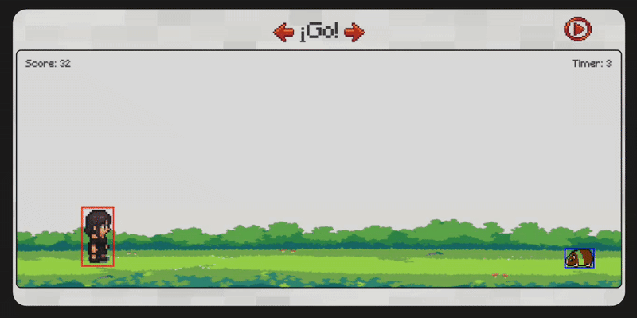
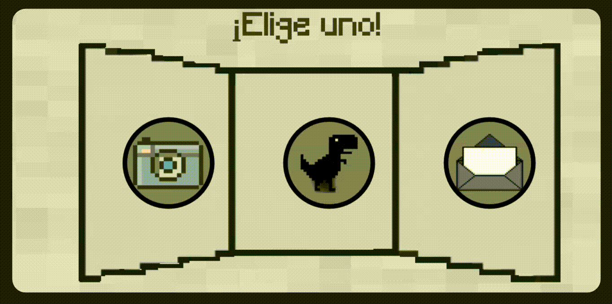

<a id="readme-top"></a>

<br />
<div align="center">
  <a href="https://github.com/othneildrew/Best-README-Template">
    
  </a>

  <h3 align="center">Naback-deskop</h3>

  <p align="center">
    A desktop application created for learning purposes, built with Rust and slint.
    <br />
    <a href="https://github.com/othneildrew/Best-README-Template"><strong>Explore the docs »</strong></a>
    <br />
    <br />
    <a href="https://github.com/othneildrew/Best-README-Template">View Demo</a>
    &middot;
    <a href="https://github.com/othneildrew/Best-README-Template/issues/new?labels=bug&template=bug-report---.md">Report Bug</a>
    &middot;
    <a href="https://github.com/othneildrew/Best-README-Template/issues/new?labels=enhancement&template=feature-request---.md">Request Feature</a>
  </p>
</div>


<!-- TABLE OF CONTENTS -->
<details>
  <summary>Table of Contents</summary>
  <ol>
    <li>
      <a href="#about-the-project">About The Project</a>
      <ul>
        <li><a href="#built-with">Built With</a></li>
      </ul>
    </li>
    <li>
      <a href="#getting-started">Getting Started</a>
      <ul>
        <li><a href="#prerequisites">Prerequisites</a></li>
        <li><a href="#installation">Installation</a></li>
      </ul>
    </li>
    <li><a href="#usage">Usage</a></li>
    <li><a href="#roadmap">Roadmap</a></li>
    <li><a href="#contributing">Contributing</a></li>
    <li><a href="#license">License</a></li>
    <li><a href="#contact">Contact</a></li>
    <li><a href="#acknowledgments">Acknowledgments</a></li>
  </ol>
</details>

## About The Project



This project was born from my curiosity to explore new tools and technologies. I wanted to challenge myself by diving into Rust, a language known for its safety and performance, and pair it with Slint, a modern UI toolkit that caught my attention for its simplicity and elegance.

While learning was the main goal, I also wanted to build something visually engaging (and also minecraft/pixelart style) - maybe even nice enough to share with someone (@@@@@)

<p align="right">(<a href="#readme-top">back to top</a>)</p>


### Built With

This section should list any major frameworks/libraries used to bootstrap your project. Leave any add-ons/plugins for the acknowledgements section. Here are a few examples.

This project was built entirely with:

[![Rust][Rust-lang]][Rust-url]
[![Slint][Slint.dev]][Slint-url]

<p align="right">(<a href="#readme-top">back to top</a>)</p>

## Getting Started

This is a quick guide to help you set up the project locally.

### Prerequisites

Make sure you have the following installed:

* Rust
* Cargo (comes with Rust)

  ```sh
    rustup update stable  
  ```

### Installation

To get started with the project locally, just follow these simple steps:


1. Clone the repo
   ```sh
   git clone https://github.com/SebastianRojas6/Naback-deskop.git
   ```
2. Run the project
   ```sh
   cargo run
   ```
<p align="right">(<a href="#readme-top">back to top</a>)</p>

## Usage

Here's a quick look at how the project runs:




Just run the game and enjoy a simple, responsive UI built with Slint and Rust.
The goal was to explore game mechanics, animation, and UI design in a lightweight environment.

<p align="right">(<a href="#readme-top">back to top</a>)</p>

## License

Distributed under the Unlicense License. See `LICENSE.txt` for more information.

<p align="right">(<a href="#readme-top">back to top</a>)</p>

[Rust-lang]: https://img.shields.io/badge/Rust-000000?style=for-the-badge&logo=rust&logoColor=white
[Rust-url]: https://www.rust-lang.org/
[Slint.dev]: https://img.shields.io/badge/Slint-4A90E2?style=for-the-badge&logo=slint&logoColor=white
[Slint-url]: https://slint.dev/
